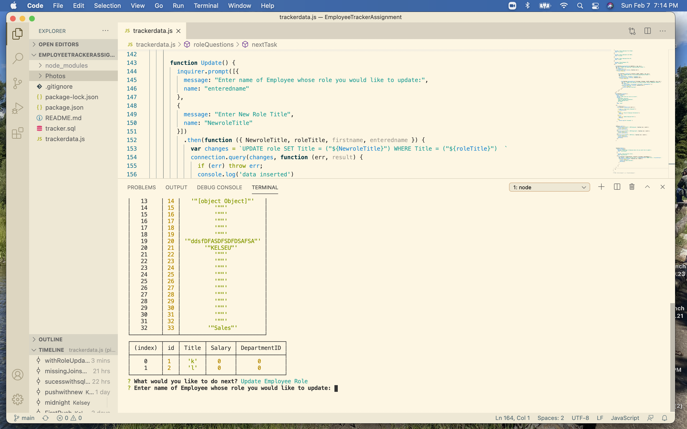
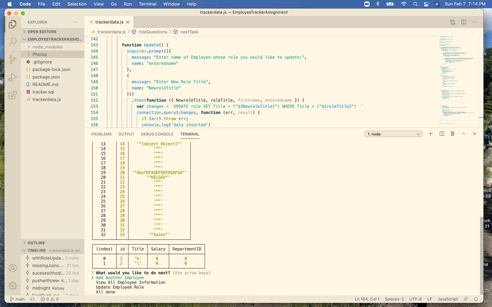
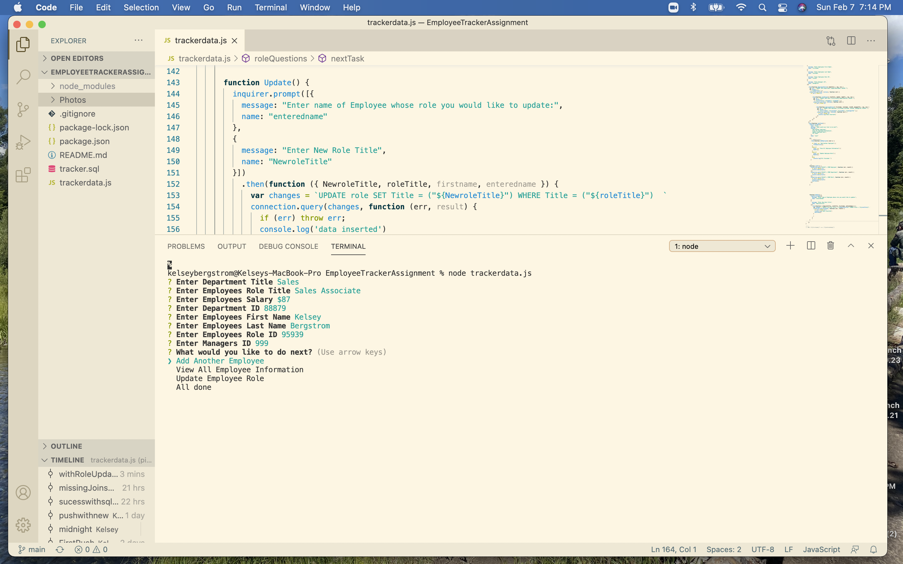

# EmployeeTrackerAssignment

This application is made for quick and easy compilation of Dperatment and Employee data. The data includes Employee role information such as Full name, Title, Role, Salary and Role IDS. The data also includes information on different Department names that their IDS. All information can be entered by the user, and will be stored and compilied in clean, neat tables. Users can alter Employee Role Data and also view all Employee Data at once. 

This project was challening in some aspects,but very interesting as well. It was my first projet using MySQL, which presented me some challenges at first. After working through them, its like everything we have learned in the Bootcamp up to this day is all coming and clicking together.

To use this app, first install all packages in your terminal, and then run node. Enter employee info as you wish, Update role or view all your inputed data.

Walkthrough Video: https://www.youtube.com/watch?v=9ftq4k_SLvs

